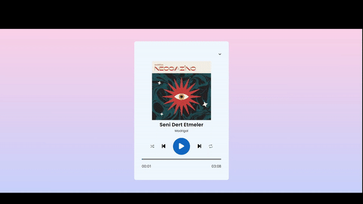

# Muzik-Calar

<h1>Music Player</h1>

<h2>HTML5, CSS3 ve JavaScript kullanılarak geliştirilmiş kullanıcı dostu bir müzik çalar uygulamasını içerir. Ayrıca responsive bir tasarıma sahiptir, bu nedenle farklı ekran boyutlarında sorunsuz bir şekilde çalışır.

## Özellikler

- MP3 formatındaki müzik dosyalarını çalma ve durdurma
- Şarkı süresini gösterme
- Karışık çalma veşarkıyı yeniden oynatma özelliği
- İleri ve geri sarma özelliği
- Responsive tasarım
</h2>

<h2>ekran görüntüsü</h2>

# Music-Player
# Music-Player
# Muzik-Calar
